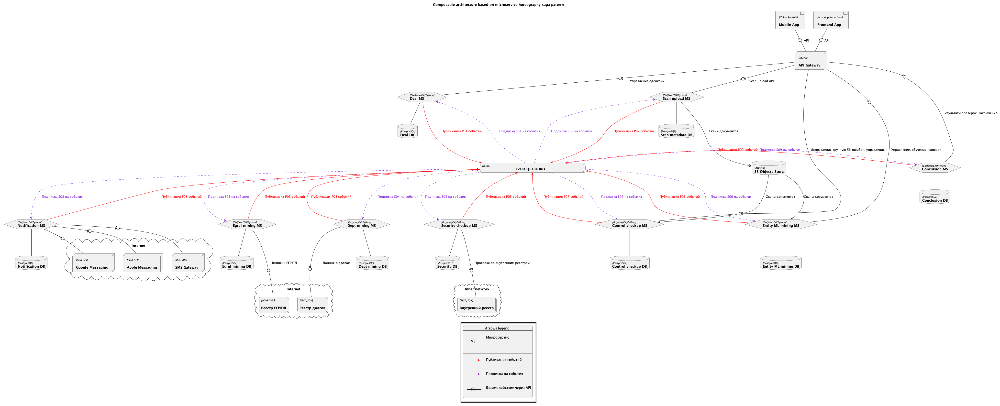
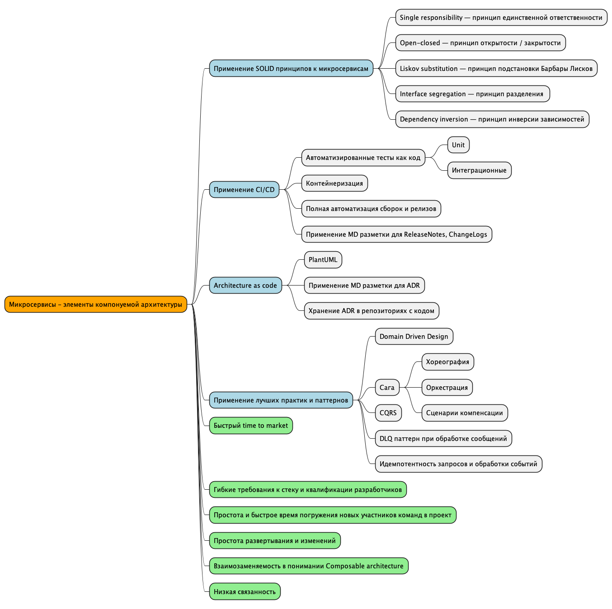
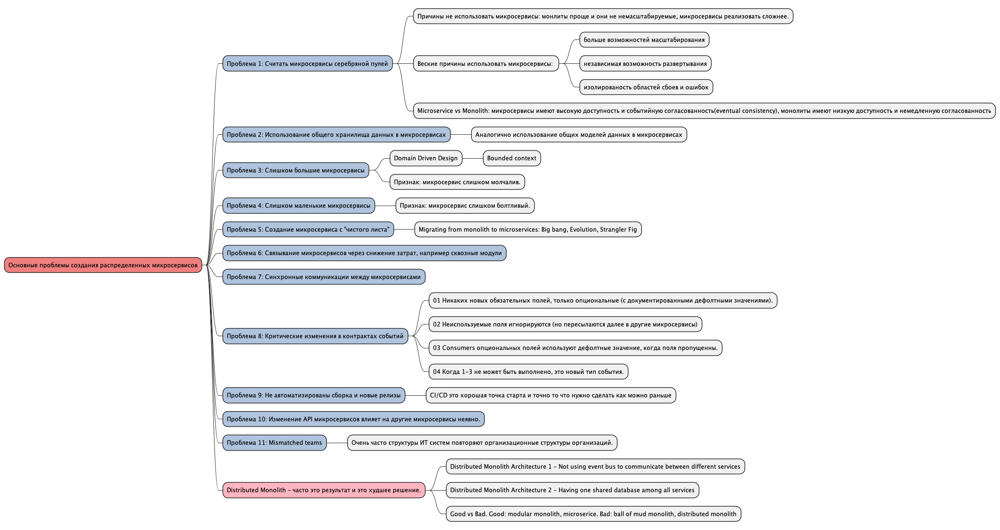
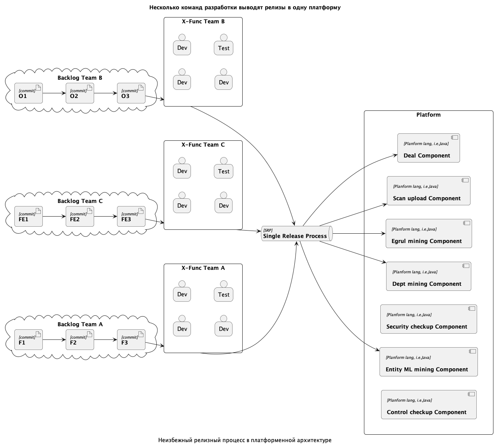
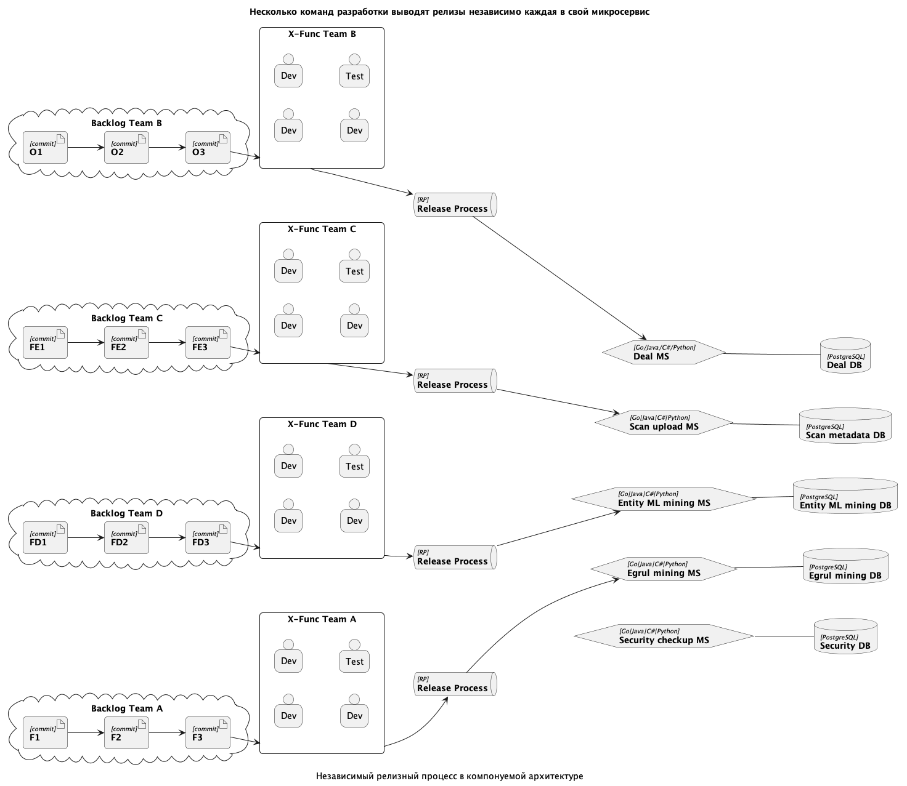

# Система проверки сделок в концепции Composable Architecture

Composable Architecture of deal checking system

### Краткое описание решения

Архитектура системы построена на основе паттерна SAGA(хореография). Domain Driven Design применен к разделению предметных областей микросервисов. В системе девять низко связанных, независимых и взаимозаменяемых микросервисов. У каждого микросервиса своя бд для хранения данных из предметной области ограниченного контекста (не исключая необходимые общие данные). Для работы с БД применен паттерн CQRS для снижения читающей нагрузки на БД микросервисов. Для хранения объектов применено S3 совместимое решение. В качестве шины обмена событиями применен кластер Kafka, гарантирующий консистентность каждого типа события в рамках одной партиции (с применением соответсвующих перманентных ключей публикации). Для работы с очередями сообщений событий применен паттерн DLQ (Dead Letter Queue). Все предоставляемые API агрегируются посредством API Gateway (NGinx). Клиентами системы рассматриваются фронтенд приложения и мобильные приложения. Оба типа приложений используют предоставляемое микросервисами API.

Посредством API клиентские приложения:

- создают сделку, требующую проверки;
- указывают необходимые известные данные;
- загружают сканы или фото документов для анализа и проверки;
- управляют процессом проверки, видят текущий статус
- сотрудники правового отдела видят и могут вручную обработать документы которые не удалось распознать или извлечь из них полезные данные (достигается применением паттерна DLQ)
- получают результат проверки и заключение (вместе со всем метаданными и материалами для возможности проверки вручную)
- специалисты по машинному обучению могут обновлять словари и метаязык поиска сущностей

### Описание API и событий

Полное описание API опущено для экономии времени. В реальном проекте обязательно необходимо разработать описание api в формате OpenAPI и включить его в состав архитектурного репозитория. Аналогично опущено описание типов и состава событий которыми обмениваются микросервисы.

### Архитектура как код

Данный проект демонстрирует один из возможных подходов к управлению архитектурой в стиле Architecture as code. Все схемы написаны на Puml. Исходники расположены в разделе `docs/diagrams/src`. Записи архитектурных решений в разделе `docs/diagrams/desitions`. Для удобного просомтра рекомендуется открыть проект в VS Code, установить локально [PlantUML](https://plantuml.com/ru/) и плагин `ext install plantuml` [https://github.com/qjebbs/vscode-plantuml](https://github.com/qjebbs/vscode-plantuml).

_Архитектурная схема_

#### Перечень технологий и общих компонент, необходимых для эксплуатации

- Для обеспечения событийной консистентности и at least once доставки в качестве шины событий должно быть применена Kafka.
- Объектное хранилище может быть реализовано на S3(Simple Storage Service) совместимом решении, например Minio.
- API Gateway может быть реализовано с использованием решений NGinx
- Микросервисы могут быть реализованы на любом современном языке программирования/фреймворке. За счет низкой связанности возможно не предъявлять строгих требований к стеку.
- Базы данных микросервисов могут быть любыми из современных, гарантирующих целостность и позволяющих применять CQRS паттерн. Из-за низкой связанности разные команды могут применять разные бд. Это создает дополнительную гибкость для бизнеса, особенно для крупных компаний.

#### Спроектированная система соответствует всем требованиям и лучшим практикам изложенным далее

## Преимущества Composable technologies для Composable business

- Позволяет достичь быстрый time to market
- Позволяет работать независимым командам каждой над своим микросервисом и на своем стеке.
- Упрощает и ускоряет погружение новых участников команд в проект.
- Упрощает релизный процесс.
- Упрощает поддержку и новые доработки.
- Позволяет разрабатывать микросервисы взаимозаменяемыми и низко связанными между собой и другими компонентами и приложениями.

Для глубокого понимания рассмотрим технологию микросервисов как элементов Composable Architecture. На следующей интеллект карте определены свойства микросервиса (зеленый цвет) и способы достижения таких свойств(светло-синий цвет), чтобы микросервис был элементом Composable Architecture современного бизнеса. Исходник схемы тут `docs/diagrams/src/mindmap.puml`

Многие компании в своем пути к микросервисной архитектура сталкиваются с разными проблемами не разрешив которые результатом часто является промежуточная архитектура "распределенный монолит". Между микросервисами высокая связанность и(или) используется общая БД или модели данных. Этот результат - худший, хуже монолита. Существуют и другие проблемы с микросервисами. Вот основные распространенные на след схеме. Исходник схемы тут `docs/diagrams/src/problemindmap.puml`

### Time to market и релизный процесс

Рассмотрим преимущества стратегии применения компонуемой архитектуры в релизном процессе. Рассмотрим как выглядит релизный процесс в монолите или на основе общей платформы. Для распределенного монолита картина аналогичная. Исходник схемы тут `docs/diagrams/src/release-monolith.puml`

Единый релизный процесс неизбежно становится узким горлышком в жизненном цикле любой системы. Не зависимо от количества команд, время time to market будет расти. Это обусловлено единой платформой, монолитом или высокой связанность распределенного монолита. Для единой платформы и монолита к этому еще добавляется ограничени по стеку технологий и все команды обязаны будут работать на одном стеке технологий.

Рассмотрим как выглядит релизный процесс в спроектированной системе в коцепции Composable Architecture. Исходник схемы тут `docs/diagrams/src/release-composable.puml`

Каждая команда выполняют релизы независимо друг от друга. Риски получить бутылочное горлышко в релизном процессе значительно снижаются. Низкая связанность микросервисов позволяет этого достичь. Применение автоматизации тестирования и CI/CD позволяют добиться непрерывной и быстрой доставки в прод каждой новой доработки. К тому же при такой архитектуре снимаются ограничения по применямому стеку технологий. Это особенно актуально для больших компаний, в которых могут быть самые разные специалисты.

### Выводы

Все описанные ценности создают возможности для бизнеса быть гибким, быстро реагировать на изменения, снижать риски и добиваться лидерства. Подход к управлению архитектурой как кодом может эффективно решать проблему "отставания" архитектуры от кодовой базы.
